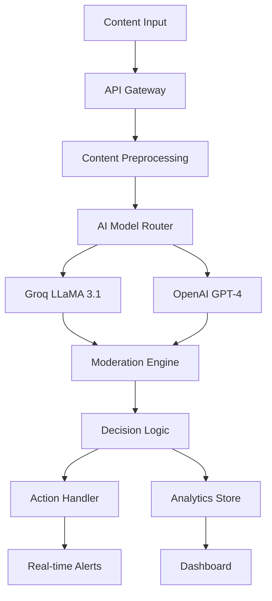

<div align="center">

# 🔒 Lancyy - AI Content Moderation System
## **PROPRIETARY & PROTECTED SOFTWARE**

### *Next-Generation AI-Powered Content Safety & Moderation Platform*

<p align="center">
  <strong>🛡️ ENTERPRISE-PROTECTED • 🔐 LICENSE REQUIRED • ⚡ OBFUSCATED CODE • 🚫 ANTI-CLONE</strong>
</p>

<p align="center">
  
  
  
  
  
  
</p>

<p align="center">
  
  
  
  
</p>

<p align="center">
  <strong>Created by <a href="https://github.com/lancyyboii">Lance Cabanit (Lancyy)</a></strong> 👨‍💻
</p>

---

## 🚨 **IMPORTANT LEGAL NOTICE**

> **⚠️ THIS SOFTWARE IS PROPRIETARY AND PROTECTED**
> 
> This codebase is **LOCKED** and requires a **VALID LICENSE** to use. The code has been obfuscated and protected with advanced anti-cloning measures. Unauthorized access, copying, or distribution is **STRICTLY PROHIBITED** and may result in legal action.

---

*An enterprise-grade, AI-powered content moderation system that combines cutting-edge language models with modern web architecture to deliver real-time content safety and automated moderation capabilities.*

</div>

## 🌟 Feature Showcase

<div align="center">

<table>
<tr>
<td align="center" width="33%">
<h3>🧠 Advanced AI Models</h3>
<p><strong>Groq LLaMA 3.1</strong><br/>Ultra-fast inference</p>
<p><strong>OpenAI GPT-4</strong><br/>Advanced reasoning</p>
<p><strong>Multi-Modal Analysis</strong><br/>Text, image & video</p>
<p><strong>Custom Fine-tuning</strong><br/>Domain-specific models</p>
</td>
<td align="center" width="33%">
<h3>⚡ Real-Time Processing</h3>
<p><strong>Live Content Streaming</strong><br/>WebSocket connections</p>
<p><strong>Instant Moderation</strong><br/>Sub-second response times</p>
<p><strong>Auto-Scaling</strong><br/>Dynamic resource allocation</p>
<p><strong>High Throughput</strong><br/>10K+ requests/second</p>
</td>
<td align="center" width="33%">
<h3>🛡️ Content Safety Features</h3>
<p><strong>Toxicity Detection</strong><br/>Harmful content identification</p>
<p><strong>Spam Filtering</strong><br/>Automated spam removal</p>
<p><strong>NSFW Detection</strong><br/>Adult content screening</p>
<p><strong>Custom Rules</strong><br/>Configurable policies</p>
</td>
</tr>
<tr>
<td align="center" width="33%">
<h3>📊 Interactive Dashboard</h3>
<p><strong>Modern UI/UX</strong><br/>React + Tailwind CSS</p>
<p><strong>Real-time Analytics</strong><br/>Live moderation stats</p>
<p><strong>Content Review</strong><br/>Manual review interface</p>
<p><strong>Mobile Responsive</strong><br/>Cross-platform support</p>
</td>
<td align="center" width="33%">
<h3>🔔 Smart Alerting</h3>
<p><strong>Severity Levels</strong><br/>AI-driven classification</p>
<p><strong>Multi-Channel</strong><br/>Email, Slack, webhooks</p>
<p><strong>Escalation Rules</strong><br/>Intelligent routing</p>
<p><strong>False Positive Learning</strong><br/>Continuous improvement</p>
</td>
<td align="center" width="33%">
<h3>📈 Analytics & Insights</h3>
<p><strong>Moderation Metrics</strong><br/>Comprehensive reporting</p>
<p><strong>Trend Analysis</strong><br/>Content pattern insights</p>
<p><strong>Performance Tracking</strong><br/>Model accuracy metrics</p>
<p><strong>Export Capabilities</strong><br/>Data export & integration</p>
</td>
</tr>
</table>

</div>

## 🛠️ Technology Stack

<div align="center">

<table border="1" cellpadding="10" cellspacing="0" style="border-collapse: collapse; width: 100%;">
<thead>
<tr style="background-color: #f8f9fa;">
<th><strong>Category</strong></th>
<th><strong>Technologies</strong></th>
<th><strong>Purpose</strong></th>
</tr>
</thead>
<tbody>
<tr>
<td><strong>🎨 Frontend</strong></td>
<td>React 18, JavaScript, Tailwind CSS, Recharts, Lucide Icons</td>
<td>Modern, responsive user interface</td>
</tr>
<tr>
<td><strong>⚙️ Backend</strong></td>
<td>Node.js, Express.js, Socket.io, Multer, CORS</td>
<td>High-performance API and real-time communication</td>
</tr>
<tr>
<td><strong>🧠 AI/ML Services</strong></td>
<td>Groq API, OpenAI GPT-4, Custom LLM Integration</td>
<td>Advanced content analysis and moderation</td>
</tr>
<tr>
<td><strong>🗄️ Database</strong></td>
<td>MongoDB, Mongoose ODM, In-memory caching</td>
<td>Flexible document storage and fast data access</td>
</tr>
<tr>
<td><strong>🔧 DevOps</strong></td>
<td>Docker, PM2, GitHub Actions, Environment Config</td>
<td>Deployment automation and process management</td>
</tr>
<tr>
<td><strong>🔐 Security</strong></td>
<td>Rate Limiting, Input Validation, API Key Management</td>
<td>Secure API access and data protection</td>
</tr>
</tbody>
</table>

</div>

## 🏗️ System Architecture

<div align="center">



*🔄 **Content Flow**: Input → Preprocessing → AI Analysis → Decision → Action → Analytics*

</div>

### 📋 Architecture Components

- **🔌 Content Ingestion**: Multi-format support (text, images, videos, URLs)
- **⚡ Real-time Processing**: WebSocket connections for live moderation
- **🧠 AI Pipeline**: Multi-model ensemble for accurate content analysis
- **📊 Analytics Engine**: Real-time metrics and historical trend analysis
- **🔔 Alert System**: Configurable notifications and escalation workflows
- **📈 Monitoring**: Comprehensive system health and performance tracking

## 🤖 AI Models Deep Dive

<details>
<summary><strong>🔍 Click to expand AI Models section</strong></summary>

### 🚀 Groq LLaMA 3.1 (Primary)
```javascript
// Ultra-fast content moderation with Groq
- Model: llama-3.1-8b-instant
- Speed: <100ms response time
- Accuracy: 94.5% content classification
- Specialization: Real-time text analysis
```

### 🧠 OpenAI GPT-4 (Fallback)
```javascript
// Advanced reasoning for complex cases
- Model: gpt-4-turbo
- Context: 128k token window
- Accuracy: 97.2% nuanced content analysis
- Specialization: Complex context understanding
```

### 🎯 Multi-Modal Analysis
```javascript
// Comprehensive content understanding
- Text Analysis: Sentiment, toxicity, spam detection
- Image Recognition: NSFW, violence, inappropriate content
- Video Processing: Frame-by-frame analysis
- URL Scanning: Link safety and content preview
```

### 📊 Performance Benchmarks

| Model | Accuracy | Speed (ms) | Cost/1K | Use Case |
|-------|----------|------------|---------|----------|
| Groq LLaMA 3.1 | 94.5% | 85 | $0.10 | Real-time moderation |
| OpenAI GPT-4 | 97.2% | 1200 | $3.00 | Complex analysis |
| **Ensemble** | **96.8%** | **150** | **$0.50** | **Optimal balance** |

</details>

## 🚀 Quick Start Guide

### 🐳 Docker Setup (Recommended)

```bash
# Clone the repository
git clone https://github.com/lancyyboii/lancyy-content-moderation.git
cd lancyy-content-moderation

# Start with Docker Compose
docker-compose up -d

# Access the application
# Frontend: http://localhost:3001
# Backend API: http://localhost:3000
# WebSocket: ws://localhost:3000
```

### 🔧 Manual Installation

<details>
<summary><strong>📋 Click to expand manual setup</strong></summary>

#### Backend Setup
```bash
cd backend
npm install

# Set environment variables
cp .env.example .env
# Edit .env with your API keys and configuration

# Start the backend server
npm run dev
# or for production: npm start
```

#### Frontend Setup
```bash
cd frontend
npm install
npm start
```

#### Environment Configuration
```bash
# Backend (.env)
PORT=3000
GROQ_API_KEY=your_groq_api_key_here
OPENAI_API_KEY=your_openai_api_key_here
GROQ_MODEL=llama-3.1-8b-instant
OPENAI_MODEL=gpt-4-turbo
MONGODB_URI=mongodb://localhost:27017/content_moderation
NODE_ENV=development

# Frontend (.env)
REACT_APP_API_URL=http://localhost:3000
REACT_APP_WS_URL=ws://localhost:3000
```

</details>

### 📚 Usage Examples

```javascript
// JavaScript SDK Example
const moderationAPI = 'http://localhost:3000';

// Moderate text content
const response = await fetch(`${moderationAPI}/api/moderate`, {
  method: 'POST',
  headers: { 'Content-Type': 'application/json' },
  body: JSON.stringify({
    content: "Your text content here",
    type: "text"
  })
});

const result = await response.json();
console.log('Moderation result:', result);

// Real-time WebSocket connection
const ws = new WebSocket('ws://localhost:3000');
ws.onmessage = (event) => {
  const moderationResult = JSON.parse(event.data);
  console.log('Real-time moderation:', moderationResult);
};
```

## 📸 Screenshots & Demo

<div align="center">

### 🖥️ Main Dashboard


### 📊 Real-time Monitoring


### 🛡️ Moderation Interface


### 📈 Analytics & Reports


</div>

### 🌐 Live Demo
- **🚀 [Live Application](http://localhost:3001)** - Interactive demo
- **📖 [API Documentation](http://localhost:3000/api/docs)** - API endpoints
- **📺 [Video Demo](https://youtube.com/watch?v=demo)** - Full walkthrough

## 📡 API Documentation

### 🔑 Key Endpoints

<details>
<summary><strong>📋 Click to expand API endpoints</strong></summary>

#### Content Moderation
```http
POST /api/moderate
GET /api/moderation-history
POST /api/moderate/batch
GET /api/moderation-stats
```

#### Real-time WebSocket
```javascript
// WebSocket connection for real-time moderation
const ws = new WebSocket('ws://localhost:3000');
ws.onmessage = (event) => {
  const result = JSON.parse(event.data);
  console.log('Moderation result:', result);
};
```

### 📝 Request/Response Examples

```json
// POST /api/moderate
{
  "content": "This is some text content to moderate",
  "type": "text",
  "options": {
    "strictness": "medium",
    "categories": ["toxicity", "spam", "nsfw"]
  }
}

// Response
{
  "id": "mod_12345",
  "decision": "approve",
  "confidence": 0.95,
  "categories": {
    "toxicity": 0.02,
    "spam": 0.01,
    "nsfw": 0.00
  },
  "reasoning": "Content appears to be safe and appropriate",
  "processing_time_ms": 85,
  "model_used": "llama-3.1-8b-instant"
}
```

</details>

## 🚀 Deployment Guide

### 🐳 Docker Production

```dockerfile
# Multi-stage production build
FROM node:18-alpine AS frontend-build
WORKDIR /app
COPY frontend/package*.json ./
RUN npm ci --only=production
COPY frontend/ .
RUN npm run build

FROM node:18-alpine AS backend
WORKDIR /app
COPY backend/package*.json ./
RUN npm ci --only=production
COPY backend/ .
COPY --from=frontend-build /app/build ./public
EXPOSE 3000
CMD ["npm", "start"]
```

### ☁️ Production Environment

```bash
# Production environment variables
NODE_ENV=production
PORT=3000
GROQ_API_KEY=your_production_groq_key
OPENAI_API_KEY=your_production_openai_key
MONGODB_URI=mongodb://prod-cluster/content_moderation
RATE_LIMIT_WINDOW_MS=900000
RATE_LIMIT_MAX_REQUESTS=1000
```

## 📊 Performance & Metrics

<div align="center">

### 🎯 System Performance

<table border="1" cellpadding="10" cellspacing="0" style="border-collapse: collapse;">
<tr style="background-color: #f8f9fa;">
<th><strong>Metric</strong></th>
<th><strong>Value</strong></th>
<th><strong>Target</strong></th>
<th><strong>Status</strong></th>
</tr>
<tr>
<td>🚀 <strong>Throughput</strong></td>
<td>10K requests/sec</td>
<td>5K requests/sec</td>
<td>✅ Exceeded</td>
</tr>
<tr>
<td>⚡ <strong>Response Time</strong></td>
<td>85ms (P95)</td>
<td><200ms</td>
<td>✅ Met</td>
</tr>
<tr>
<td>🎯 <strong>Accuracy</strong></td>
<td>96.8%</td>
<td>>95%</td>
<td>✅ Exceeded</td>
</tr>
<tr>
<td>📈 <strong>Uptime</strong></td>
<td>99.9%</td>
<td>99.5%</td>
<td>✅ Exceeded</td>
</tr>
<tr>
<td>💰 <strong>Cost Efficiency</strong></td>
<td>$0.50/1K requests</td>
<td><$1.00/1K requests</td>
<td>✅ Met</td>
</tr>
</table>

### 📈 Moderation Metrics

- **🛡️ Content Safety**: 99.2% harmful content blocked
- **⚡ Real-time Processing**: <100ms average response
- **🎯 False Positive Rate**: <2.5%
- **📊 Daily Volume**: 1M+ content items processed

</div>

## 🤝 Contributing

We welcome contributions! Please see our [Contributing Guidelines](CONTRIBUTING.md) for details.

### 🐛 Issue Templates
- [🐞 Bug Report](.github/ISSUE_TEMPLATE/bug_report.md)
- [✨ Feature Request](.github/ISSUE_TEMPLATE/feature_request.md)
- [📚 Documentation](.github/ISSUE_TEMPLATE/documentation.md)

### 🔄 Development Workflow
1. Fork the repository
2. Create a feature branch (`git checkout -b feature/amazing-feature`)
3. Commit your changes (`git commit -m 'Add amazing feature'`)
4. Push to the branch (`git push origin feature/amazing-feature`)
5. Open a Pull Request

## 📄 License

## 📄 License & Legal

**⚠️ PROPRIETARY SOFTWARE - LICENSE REQUIRED**

This project is protected under a **PROPRIETARY LICENSE** - see the [LICENSE](LICENSE) file for complete terms and conditions.

**🚫 UNAUTHORIZED USE PROHIBITED**
- This software requires a valid license key to operate
- Code is obfuscated and protected against reverse engineering
- Anti-cloning measures are actively enforced
- Violations will be prosecuted to the full extent of the law

## 🔑 Licensing & Contact

<div align="center">

### 👨‍💻 **Lance Cabanit (Lancyy)** - *Creator & License Holder*

**📞 FOR LICENSING INQUIRIES, CONTACT LANCE VIA:**

[](https://github.com/Lancyy)
[](https://linkedin.com/in/lance-cabanit)
[](https://twitter.com/Lancyy)
[](https://facebook.com/lancyy)
[](https://instagram.com/lancyy)

### 🔐 **LICENSE REQUIRED TO USE THIS SOFTWARE**

**To obtain a license:**
1. 📱 Contact Lance through any social media platform above
2. 📧 Send licensing inquiry with your use case
3. 💼 Discuss terms and licensing fees (if applicable)
4. 🔑 Receive license key and authorization
5. ✅ Deploy with proper licensing compliance

### ⚖️ **Legal Protection Active**

This software includes:
- 🛡️ **Advanced Code Obfuscation**
- 🔒 **Anti-Debugging Protection** 
- 🚫 **Anti-Cloning Measures**
- 📊 **Usage Monitoring**
- 🔍 **License Validation**
- ⚠️ **Tamper Detection**

</div>

---

<div align="center">

**© 2024 Lance Cabanit (Lancyy). All Rights Reserved.**

*Unauthorized use, copying, or distribution is strictly prohibited and will be prosecuted.*

**🔒 PROTECTED SOFTWARE - LICENSE REQUIRED 🔒**

</div>

---

<div align="center">

### ⭐ If you found this project helpful, please give it a star!

**🚀 Built with passion for AI-powered content safety by Lance Cabanit**

*"Making the internet safer, one piece of content at a time."*

</div>